

  

 

 

  <a href="https://github.com/Automattic/mongoose/pull/16406">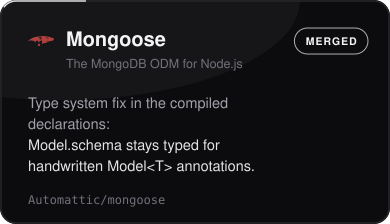</a>&nbsp;<a href="https://github.com/nestjs/cache-manager/pull/962">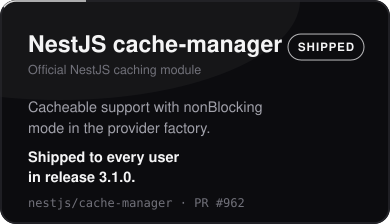</a>&nbsp;<a href="https://github.com/ever-co/ever-gauzy/commits?author=samuelmbabhazi">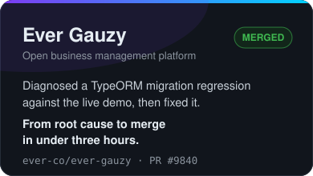</a>&nbsp;<a href="https://github.com/nestjs/mongoose/pull/2859">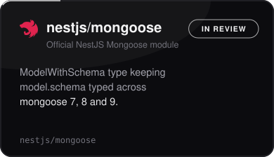</a>&nbsp;<a href="https://github.com/ever-co/ever-teams/commits?author=samuelmbabhazi">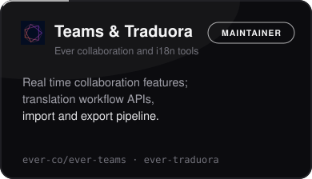</a>&nbsp;<a href="https://github.com/ever-co/ever-traduora/commits?author=samuelmbabhazi">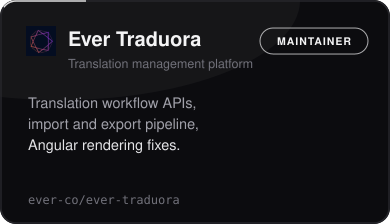</a>&nbsp;<a href="https://commons.wikimedia.org/wiki/User:Samuel_mbabhazi">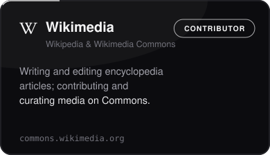</a>

 

 

  

 

 

  

 

 

  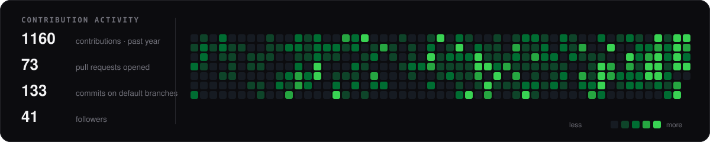

   

  

 

 

**Open to remote opportunities and freelance projects**

I build clean, scalable, production-grade applications with TypeScript-first architecture.
I write about NestJS architecture, TypeScript patterns and GraphQL API design on dev.to.

 

  &nbsp;&nbsp;&nbsp;&nbsp;&nbsp;

    

  

