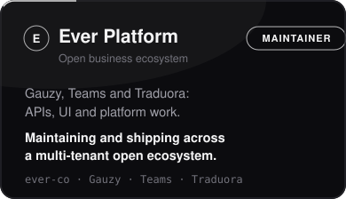

  

 

 

  &nbsp;&nbsp;

 

Every card is clickable and leads to the proof. More in the same ecosystems:

| Project | Contribution |
|---------|--------------|
| [**nestjs/mongoose**](https://github.com/nestjs/mongoose/pull/2859) | Root cause analysis of the `Model.schema` typing issue plus a `ModelWithSchema<T>` type, verified against mongoose 7, 8 and 9 · in review |
| [**Ever Teams**](https://github.com/ever-co/ever-teams) | Service layer improvements, state management and real time collaboration features |
| [**Ever Traduora**](https://github.com/ever-co/ever-traduora) | REST API and Angular rendering fixes in the translation import and export workflow |

 

 

  

 

 

  

 

 

  
  

    

| Achievement | Count | Description |
|:-----------:|:-----:|-------------|
| 🤝 **Pair Extraordinaire** | x3 | Consistent collaborative pull request quality |
| 🦈 **Pull Shark** | x3 | High-volume merged pull requests across codebases |

   

  

 

 

**Open to remote opportunities and freelance projects**

I build clean, scalable, production-grade applications with TypeScript-first architecture.
I write about NestJS architecture, TypeScript patterns and GraphQL API design on dev.to.

 

  &nbsp;&nbsp;&nbsp;&nbsp;&nbsp;

    

  

