

  <picture><source media="(prefers-color-scheme: dark)" srcset="./assets/dark/hero.svg"></picture>

 

<picture><source media="(prefers-color-scheme: dark)" srcset="./assets/dark/sep-impact.svg"></picture>

 

  <a href="https://github.com/Automattic/mongoose/pulls?q=is%3Apr+author%3Asamuelmbabhazi"><picture><source media="(prefers-color-scheme: dark)" srcset="./assets/dark/card-mongoose.svg">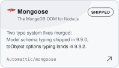</picture></a>&nbsp;<a href="https://github.com/nestjs/cache-manager/pull/962"><picture><source media="(prefers-color-scheme: dark)" srcset="./assets/dark/card-nestjs.svg">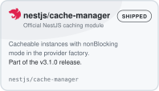</picture></a>&nbsp;<a href="https://github.com/nestjs/mongoose/pull/2859#issuecomment-5318278051"><picture><source media="(prefers-color-scheme: dark)" srcset="./assets/dark/card-nestmongoose.svg">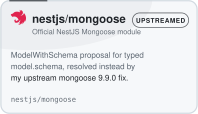</picture></a>&nbsp;<a href="https://github.com/ever-co/ever-gauzy/commits?author=samuelmbabhazi"><picture><source media="(prefers-color-scheme: dark)" srcset="./assets/dark/card-gauzy.svg">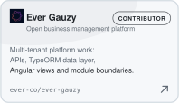</picture></a>&nbsp;<a href="https://github.com/ever-co/ever-teams/commits?author=samuelmbabhazi"><picture><source media="(prefers-color-scheme: dark)" srcset="./assets/dark/card-teams.svg">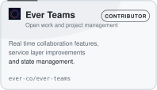</picture></a>&nbsp;<a href="https://github.com/ever-co/ever-traduora/pulls?q=is%3Apr+author%3Asamuelmbabhazi"><picture><source media="(prefers-color-scheme: dark)" srcset="./assets/dark/card-traduora.svg">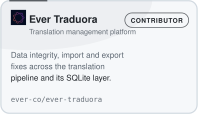</picture></a>&nbsp;<a href="https://commons.wikimedia.org/wiki/User:Samuel_mbabhazi"><picture><source media="(prefers-color-scheme: dark)" srcset="./assets/dark/card-wikipedia.svg"></picture></a>&nbsp;<a href="https://github.com/prisma/prisma-engines/pull/5854"><picture><source media="(prefers-color-scheme: dark)" srcset="./assets/dark/card-prisma.svg">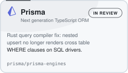</picture></a>&nbsp;<a href="https://github.com/typeorm/typeorm/pull/12749"><picture><source media="(prefers-color-scheme: dark)" srcset="./assets/dark/card-typeorm.svg">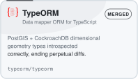</picture></a>

 

<picture><source media="(prefers-color-scheme: dark)" srcset="./assets/dark/sep-about.svg"></picture>

 

  <picture><source media="(prefers-color-scheme: dark)" srcset="./assets/dark/about.svg"></picture>

 

<picture><source media="(prefers-color-scheme: dark)" srcset="./assets/dark/sep-stack.svg"></picture>

 

  <picture><source media="(prefers-color-scheme: dark)" srcset="./assets/dark/stack.svg">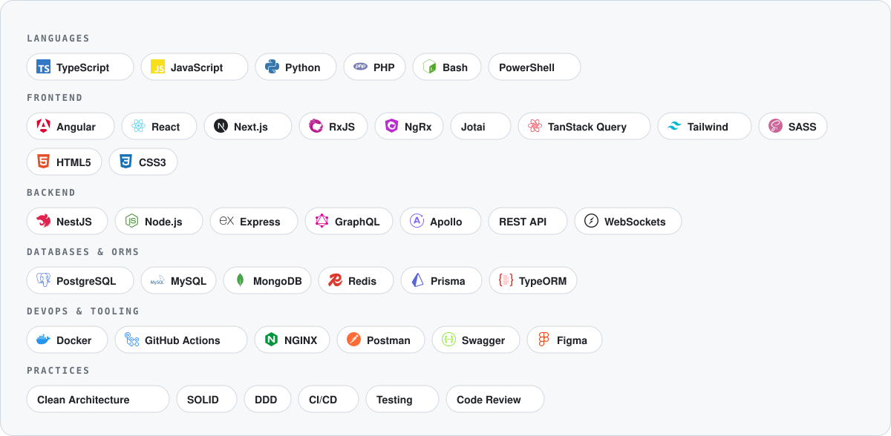</picture>

 

<picture><source media="(prefers-color-scheme: dark)" srcset="./assets/dark/sep-stats.svg"></picture>

 

  <picture><source media="(prefers-color-scheme: dark)" srcset="./assets/dark/stats.svg">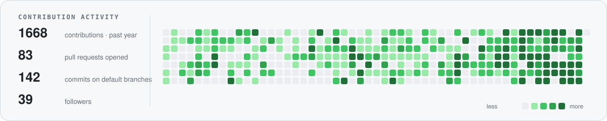</picture>

   

  

 

<picture><source media="(prefers-color-scheme: dark)" srcset="./assets/dark/sep-connect.svg"></picture>

 

**Open to remote opportunities and freelance projects**

I build clean, scalable, production-grade applications with TypeScript-first architecture.
I write about NestJS architecture, TypeScript patterns and GraphQL API design on dev.to.

 

  <a href="https://github.com/samuelmbabhazi"><picture><source media="(prefers-color-scheme: dark)" srcset="./assets/dark/btn-github.svg"></picture></a>&nbsp;<a href="https://linkedin.com/in/samuelmbabhazi"><picture><source media="(prefers-color-scheme: dark)" srcset="./assets/dark/btn-linkedin.svg"></picture></a>&nbsp;<a href="https://samuelmbabhazi.com"><picture><source media="(prefers-color-scheme: dark)" srcset="./assets/dark/btn-portfolio.svg"></picture></a>&nbsp;<a href="mailto:samuelmbabhazi@gmail.com"><picture><source media="(prefers-color-scheme: dark)" srcset="./assets/dark/btn-email.svg"></picture></a>&nbsp;<a href="https://www.upwork.com/freelancers/~013636cfc522b0d380"><picture><source media="(prefers-color-scheme: dark)" srcset="./assets/dark/btn-upwork.svg"></picture></a>&nbsp;<a href="https://dev.to/samuelmbabhazi"><picture><source media="(prefers-color-scheme: dark)" srcset="./assets/dark/btn-devto.svg"></picture></a>

    

  <picture><source media="(prefers-color-scheme: dark)" srcset="./assets/dark/footer.svg"></picture>

